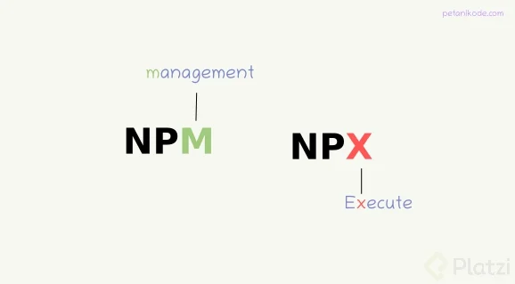
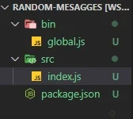

# Apuntes curso NPM

## Comandos para inicializar

**npm init** :  inicializa npm en el proyecto y genera el .json inicial

## Comados para instalacion de paquetes o dependencias

**npm install package-name** → Instala por defecto una dependencia de producción.

**npm install package-name —save-dev** → Instalar dependencia de desarrollo.

**npm install package-name -D ó npm install package-name —save** → Instalar dependencia de producción.

**npm install package-name -S** →
Los paquetes globales no se ligan a un proyecto, sino al sistema operativo. No todos los paquetes soportan ser instalados de esta forma.

**npm install -g package-name** → Instalar paquete de forma global.

**npm list** → Ver la lista de los paquetes instalados en el proyecto. Para ver los instalados de forma global se usa el flag -g.

**npm install package-name -o** → Instalar una dependencia opcional

Se pueden generar conflictos cuando se tienen paquetes que usan la misma dependencia pero en versiones diferentes. Para evitar esto se puede simular una instalación con **npm install package-name —dry-run**. Con esto se simula la instalación pero sin agregar ningún paquete, si no hay ningún conflicto se procede a instalar de la manera convencional.

**npm install package-name@0.15.0** → Instalar la versión especifica de un paquete. Si luego se quiere instalar la versión más reciente se usa npm install package-name@latest.

**npm install** → Instala las dependencias que estén dentro de un package.json.

## Comandos en NPM (Scripts)



### Cómo crear un comando en tu proyecto

Para crear un comando en tu proyecto, utiliza la siguiente estructura, donde es el nombre del comando que debería ser muy descriptivo y es el comando que utilizarías en la terminal.

    json { "scripts": { "<nombre>": "<comando>" } }

Una vez hayas escrito el comando en el archivo package.json, la manera de ejecutarlo en la terminal será con el comando **npm run nombre**.

### Creemos algunos comandos comunes

Creemos tres comandos comunes: para iniciar el proyecto (start), crear un archivo para producción (build) y combinarlos (deploy). Que no te preocupe si no entiendes cada comando, solo entiende cómo ejecuta NPM el script.

    json 
    { 

        "scripts": 
        { 
            "start": "webpack-dev-server --open -- development", 
            "build": "webpack --mode production", 
            "deploy": "npm run format && npm run build" 
        } 

    }

Y para ejecutarlos, es necesario utilizar el comando respectivo en la terminal:

    bash 
    $ npm run start
    $ npm run build 
    $ npm run deploy

NPM provee algunos alias, como npm start que ejecuta lo mismo que npm run start.

### Cómo ejecutar un paquete de manera directa

**NPM te permite instalar paquetes en tu proyecto, sin embargo, NPX (Node Package Execute) permite ejecutar un comando de NPM remotamente**.

Ejemplos de este comportamiento son los paquetes React y Nextjs, para iniciar un proyecto en estos se puede ejecutar los siguientes comandos, donde es el nombre del proyecto:

    bash 
    $ npx create-react-app <nombre> 
    $ npx create-next-app <nombre>

## Solucion de errores

Si al intentar crear la aplicación con React les da el siguiente error unknown command: "create-react-app" es porque no tienen ese paquete instalado (de forma global). Así que primeron deben instalar el paquete, para luego poder crear la app:

    npm install -g create-react-app

    npx create-react-app react-npm

## Cómo actualizar dependencias

Para actualizar todas las dependencias utiliza el siguiente comando:

bash $ npm update

Ten en cuenta que actualizar varios paquetes no es recomendable, solamente deberías actualizar un paquete si estás muy seguro de que no afectará al proyecto y que realizaste los cambios pertinentes.

    bash $ npm update <paquete>

Utiliza el siguiente comando para actualizar a la última versión (latest) de la dependencia, donde es el nombre del paquete.

    bash $ npm install <paquete>@latest

Muchas veces tenemos proyectos o tenemos que trabajar con proyectos que hace mucho tiempo han estado sin actualizarse

* Babel es un Transpilador para entender javascript moderno y lo pasa al último estándar de ECMAScript.
* Eslintrc Analizan nuestro código para dar mejorar que debemos implementar.
* .gitignore Listamos archivos, que no queremos en nuestro repositorio.
* .prettierrc estandat para manejar sintaxis
* Package.lock.json y package.json nuestros archivos estándares.

### Package.json

Este archivo base contiene la información de nuestra aplicación, algo muy parecido a un manual de lo que necesita la aplicación para funcionar de la forma correcta.

Actualización de paquetes

* npm list nos muestra todos los elementos que son parte del proyecto y los errores correspondientes si es el caso y no están instalados.

* npm install procederá a instalar todas las dependencias del proyecto y podremos tener mensajes como dependencias vulneradas, de forma moderadas, altas o criticas (deben ser atendidas inmediatamente)

* npm outdate nos mostrará cuales son las dependencias que necesitan o que pueden ser actualizadas porque han tenido alguna mejora.

* npm install react@latest si esta dependencia usa otras y también están desactualizadas, nos informará y podemos proceder a realizar la actualización de la otra >npm i react-dom@latest

## Seguridad y solución de problemas

La seguridad de tu proyecto puede ser vulnerada por paquetes desactualizados. Al momento de instalar tus paquetes con el comando **npm install muestra una serie de advertencias (NPM WARN)** de las dependencias desactualizadas.

### Auditar tus dependencias

El comando **npm audit** muestra una descripción de las dependencias instaladas. Si se encuentran vulnerabilidades, se calculará el impacto al proyecto.

Si se requiere un informe más detallado en formato JSON (JavaScript Object Notation), utiliza el comando **npm audit --json**.

El comando npm audit fix proporciona una actualización de los paquetes, similar al comando **npm update paquete**. El comando **npm audit fix --force** proporciona una actualización de los subpaquetes de cada paquete, en todos sus niveles de profundidad.

Si el problema persiste, es necesario actualizar el paquete a su última versión.

    bash $ npm install paquete@latest

### Solución de problemas

Cuando estés desarrollando un proyecto con NPM, puede que generes errores que no permitan seguir con tu trabajo. Saber manejar los errores es fundamental para solucionarlos y seguir con tus tareas (y no entrar en pánico). Alguno de estos errores pueden ser:

* Errores en la configuración del archivo package.json
* Errores de dependencias en node_modules
* Errores del sistema operativo
Configuración errónea de Git o GitHub
* Errores de escritura (typos)
* Errores que no estén ligados directamente a NPM

### Error de dependencias en node_modules

Existen situaciones en las que instalas una dependencia con una versión que no corresponde a la deseada. Esto ocurre porque NPM guarda en el caché una versión previamente instalada de un paquete, esto para mejorar los tiempos de instalación.

En esta situación, puedes utilizar los siguientes comandos, el primero para borrar el caché de NPM y el segundo para verificar si están eliminados correctamente.

    bash $ npm cache clean --force $ npm cache verify

## Eliminación de dependencias y Package lock

Conocer cómo eliminar dependencias, también es importante para mantener tus proyectos sin paquetes que no aporten la solución a tu problema, que ya no sean actualizados, o que exista una mejor implementación.


### Cómo eliminar paquetes

Existen dos formas de eliminar paquetes:

* Eliminando el paquete con el siguiente comando: **bash $ npm uninstall paquete**

* Eliminarlo manualmente del archivo package.json. Al eliminar un paquete de manera manual, es necesario actualizar el directorio de **node_modules**.

### Cómo actualizar node_modules

Actualizar el directorio **node_modules** sirve para limpiar las dependencias que previamente estaban en el proyecto. También cuando existe algún archivo corrupto o una mala instalación.

Por lo tanto, deberás eliminar el directorio de **node_modules** y después ejecutar el comando **npm install** para instalar correctamente los paquetes. En ciertas situaciones, también es necesario eliminar el archivo **package-lock.json**.

Puedes utilizar el siguiente comando de NPM para evitar escribir demasiado cada vez que lo necesites.

    json // package.json { "scripts": { "phoenix": "rm -f package-lock.json && rm -rf ./node_modules && npm i --no-fund --no-audit" } }

### Mostrar los pasos ejecutados por un comando de NPM

Para identificar el error que puede existir en tu proyecto, es necesario analizar cada paso que ejecuta un comando, para saber en qué punto específico ocurre el problema.

El **flag --dd** en un comando de NPM, te mostrará de manera detallada cada paso ejecutado. De esta manera podrás observar si existe un error para solucionarlo.

    bash $ npm [comando] --dd

Otra forma, es ejecutar el comando de NPM. Si existe un error, la terminal te mostrará los diferentes errores que encontró. Al final de este resumen, existirá una ruta con los detalles del error, puedes abrir tal archivo para observar los pasos que ejecutó.


### Qué es el archivo package-lock.json

El archivo **package-lock.json** describe todo el árbol de dependencias de cada paquete instalado.

**Cuando alguien hace fork de un repositorio no tiene el directorio node_modules por el archivo .gitignore.** Mediante el comando **npm install**, instalarán las dependencias indicadas en el package.json con la versión indicada. También, se instalarán las sub-dependencias indicadas en package-lock.json con la versión indicada.

Esto es importante para tener instaladas siempre la versión adecuada del paquete a utilizar en el proyecto.

## Crear un paquete

Al crear un paquete para NPM, podrás compartir tu trabajo a varios desarrolladores e instalar tu paquete mediante **npm install tuPaquete**. Te mostraré un ejemplo, un proyecto de mensajes aleatorios que estará instalado globalmente y se ejecutará mediante la terminal.

### Cómo colocar un nombre a tu paquete

Al publicar un paquete, es necesario que el nombre sea único, es decir, no debe existir ningún otro paquete publicado con el mismo nombre en NPM.

Sin embargo, no agregues números, ya que NPM lo detecta como spam. Es válido agregar tu nombre de usuario para diferenciarlo,

Asegúrate de eso buscando en la página oficial de NPM el nombre del paquete, si no hay coincidencias lo puedes publicar.

### Proyecto de mensajes aleatorios

Como buena práctica, crea un repositorio remoto en GitHub y clónalo en tu computador. Después, inicia un proyecto con NPM con el comando **npm init -y**. Con esto ya tienes todo listo para empezar el proyecto.

Dentro del proyecto crea la siguiente estructura de archivos:

* Un directorio llamado src que contenga el archivo principal del proyecto index.js
* Un directorio llamado bin que contenga un archivo ejecutable global.js



### Creando el archivo index.js

En el archivo index.js agrega el siguiente código:

* Un array llamado messages que contiene los mensajes
* Una función funnyCommit que mostrará de manera aleatoria los elementos del array, es decir, los mensajes aleatorios.
* Al final, exporta la función mediante module.exports.

Asi :

    const messages = [ "This is where it all begins...", "Commit committed", "Version control is awful", "COMMIT ALL THE FILES!", "The same thing we do every night, Pinky - try to take over the world!", "Lock S-foils in attack position", "This commit is a lie", "I'll explain when you're older!", "Here be Dragons", "Reinventing the wheel. Again.", "This is not the commit message you are looking for", "Batman! (this commit has no parents)", ];

    const funnyCommit = () => { const message = messages[Math.floor(Math.random() * messages.length)]; console.log(\x1b[34m${message}\x1b[89m); }

    module.exports = { funnyCommit }; ```

    Creando el archivo global.js
    En el archivo global.js agrega el siguiente código, en el que importamos el la función del archivo index.js y la ejecutamos.

### !/usr/bin/env node

let random = require('../src/index.js');

random.funnyCommit(); `` ⠀⠀#!/usr/bin/env nodees una instrucción que sirve para indicar que este archivo se ejecutará con Nodejs. Después realizamos la importación de nuestro archivoindex.js. Finalmente, ejecutamos la función de mensajes aleatoriosfunnyCommit`.

Modificar el archivo package.json para el proyecto
⠀⠀ En el archivo package.json, agrega "bin" haciendo referencia a nuestro archivo global.js y "preferGlobal" en true.

    json { ... "bin": { "random-str-msg": "./bin/global.js" }, "preferGlobal": true }

El nombre que especifiquemos dentro de "bin" será el que utilicemos en la terminal cuando el paquete esté instalado.

¡Listo! Ya tienes un paquete para publicarlo en NPM.

### NOTAS ADICIONALES (PASO A PASO)

. Crear un repositorio

* Verificar que el nombre del repositorio sea igual al nombre que tendrá en npm
  * Verificar que el nombre no esta en npm [https://www.npmjs.com/] y que no hayan dependencias que hagan lo mismo que nosotros estamos a punto de publicar.

* Clonar el repositorio en mi local

En el proyecto crearemos un archivo index.js (dentro de src) que tendrá la lógica del proyecto.

    const messages = [
    "This is where it all begins...",
    "Commit committed",
    "Version control is awful",
    "COMMIT ALL THE FILES!",
    "The same thing we do every night, Pinky - try to take over the world!",
    "Lock S-foils in attack position",
    "This commit is a lie",
    "I'll explain when you're older!",
    "Here be Dragons",
    "Reinventing the wheel. Again.",
    "This is not the commit message you are looking for",
    "Batman! (this commit has no parents)",
    ];

    const funnyCommit = () => {
    const message = messages[Math.floor(Math.random() * messages.length)];
    console.log(`\x1b[34m${message}\x1b[89m`);
    }

    module.exports = {
    funnyCommit
    };
Se crea una carpeta bin y dentro de ella el archivo global.js

### !/usr/bin/env node

    let random = require('../src/index.js');
    random.funnyCommit();

Dentro del archivo package.json añadir

    "homepage": "https://github.com/gndx/random-str-msg#readme",
    "bin": {
        "random-str-msg": "./bin/global.js"
    },
    "preferGlobal": true,
    "dependencies": {
        "g": "^2.0.1"
    }
